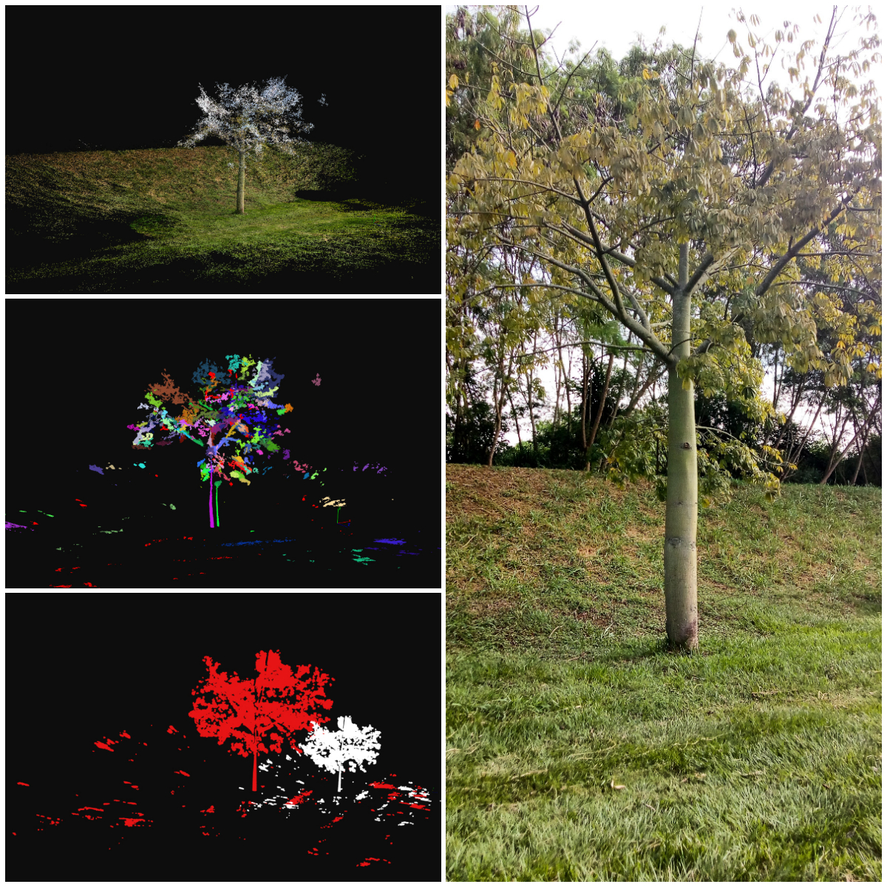
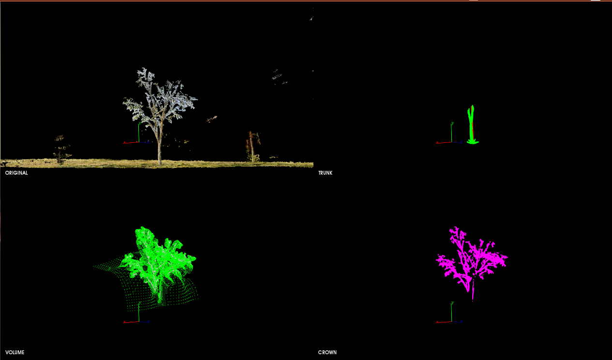

# 3D Dendrometric feature estimation of an individual tree with OpenMVG-PMVS2

*Note:* This project is a photogrammetric system for dendrometric feature estimation of individual trees. The purpose of this project is to do a 3D reconstruction of an individual tree using Open Multiple View Geometry (openMVG) and get dendrometry estimation (diameter at breast height (DBH), tree crown height, total tree height, crown volume, morphic factor and percentage crown missing) of a stem tree. For that, were used OpenMVG and PMVS for 3D Mapping, a circular pattern for scale factor estimation, PCL Library and DBScan for segmentation and Euclidean distance for dendrometric feature estimation.

----------------------
## Example

 
 

## Build cmake

To build use CMake minimum required 3.5.1 : https://github.com/Kitware/CMake

### Dataset
Images dataset in Google Drive:
* Tree1: https://drive.google.com/drive/folders/15e5q8XZuJUcQLk_ynZeljlkJmXFAAqVG?usp=sharing
* Tree2: https://drive.google.com/drive/folders/1SHkres6Ex0UFzMuqG9V7CBDIEz4nIDf5?usp=sharing
* Tree3: https://drive.google.com/drive/folders/19hX1J3fSw8WvX7-ma4me7_hjh9lAjsk-?usp=sharing
* Tree4: https://drive.google.com/drive/folders/1cN7NyDK1VAGgMcARtP4hV0MdVsHLNZc_?usp=sharing
* Tree5: https://drive.google.com/drive/folders/1ifLVliqBYHj6_6wCBpN2zcHa5HV4F6Rq?usp=sharing
* Tree6: https://drive.google.com/drive/folders/1cHlqOBxYP0mTnO-Y9pluAx98Ey32ENKt?usp=sharing

### PCD files
* https://drive.google.com/drive/folders/1sW4oqcaKPsupEaSFkoGAgdHjv6ydwUFF?usp=sharing

### Ground Truth Data
* https://docs.google.com/spreadsheets/d/1cs-I-1BxetnAPiWe4e07TfKXyPMTo7x_rN72FC26kHU/edit?usp=sharing

### Prerequisite (just compiled)

For this project it is necessary to have compiled the following libraries (it is not necessary to have installed):

- OpenCV 3.4.1: https://github.com/opencv/opencv/tree/3.4.1
- PCL 1.8.1: https://github.com/PointCloudLibrary/pcl/tree/pcl-1.8.1
- OpenMVG:https://github.com/openMVG/openMVG
- CMVS-PMVS: https://github.com/pmoulon/CMVS-PMVS

*Note:* Just set the path to build directory of each library at principal CMakeList.txt
 

 
### Other Prerequisite (installed)
The following libraries must have installed:

- Qt creator: https://www.qt.io/download
- Boost
- Eigen3
- Cereal
- Runit

### How to make

This project depends of openMVG, PCL, OpenCV, Qt and CMVS-PMVS, please compiled dependencies before.
	
* Download the src code and Unpack .zip

/src:
  	
	iTree3DMap - include
		   - libraries
		   - src
		   - CMakeLists.txt
		   - main.cpp
		   
* Once OpenMVG was compiled, just set the path build directory on...		   		   
* Replace the "SfM_SequentialPipeline.py" file at OpenMVG/openMVG_Build/software/SfM/ for "SfM_SequentialPipeline.py" file of this project.
* If pmvs2 binary file is not working, download and compile cmvs-pmvs library and replace the pmvs2 bin to /libraries folder of the package 

Within build folder, compile with cmake:

    cmake ../
    make
 
 
 
### Test

	cd /build/bin
	./itree_3dmap		

*Note:*

Just for OpenMVG compilation: If OpenMVG compiled without error and is not working, add this line to the cmake command for compilation:

	cmake -DTARGET_ARCHITECTURE=generic ../src/

and compile again. 

